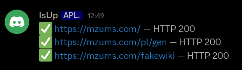
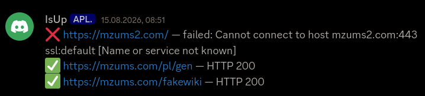

# ISUP bot

A bot that checks whether given services are working.  
I created this bot because i needed automated checks for my website.

## Features

- checks the services when you send `check` in a channel
- automated checks every hour
- sends a private message if a service fails

## Local development

1. Clone the repo  
   `git clone https://github.com/mzums/isup_bot`
2. Enter the directory  
   `cd isup_bot`
3. Create conda evironment  
   `conda create --name isup_bot python=3.12`
4. Activate the environment  
   `conda activate isup_bot`
5. Install dependencies  
   `pip install -r requirements.txt`
6. Set up your bot token, discord user id and channel id:
   `ISUP_TOKEN=...`  
   `DISCORD_USER_ID=...`  
   `ISUP_CHANNEL_ID=...`
7. Set the services you want to check
8. Configure your bot on https://discord.com/developers/home
9. Run the bot
   `python my_isup.py`
